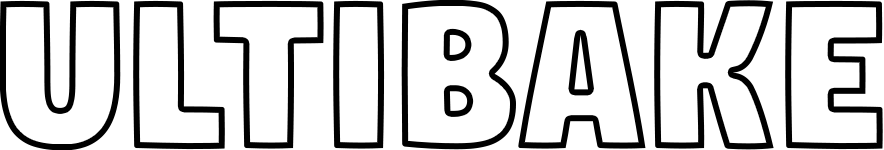

# 

## Quick Start

> The following video will show the basic usage for Ultibake.

<iframe width="420" height="315" src="https://www.youtube.com/embed/aWSn2NolLlo"></iframe>

### High to Low baking

> Baking high detail objects to low poly representations is a very common trick to getting assets to run in real-time applications. The following video will cover this topic.

<iframe width="420" height="315" src="https://www.youtube.com/embed/gd659C732qs"></iframe>

### Decal Baking

> Allows you to project any image to a low poly object. Even works if the image uses multiple masks like Normals,roughness,metallic etc.

<iframe width="420" height="315" src="https://www.youtube.com/embed/3LwLf0DBy1A"></iframe>

### Decal Stacking

> Allows you to stack decals on top of each other with control over stack order.

<iframe width="420" height="315" src="https://www.youtube.com/embed/ltRfZqC-O6g"></iframe>

### Udims

> While Ultibake handels UDIM baking automatically, this video explains how it can be used. This video also explains several extra considerations when working with decals, like how to fix decal seams and black borders.

<iframe width="420" height="315" src="https://www.youtube.com/embed/Mzp5L5xpPIg"></iframe>

