## Quickstart
> The following video will showcase most of the important features of Ultibake and quickly demonstrate how to use the addon. [Click here for more information](#Usage)

<iframe width="300em" height="200em" src="https://www.youtube.com/embed/VlecsUOZ5ew" allowfullscreen></iframe>

### High to Low Baking

> Baking high-detail objects to low-poly representations is a very common trick to make assets run in real-time applications. The following video will cover this topic.

<iframe width="300em" height="200em" src="https://www.youtube.com/embed/gd659C732qs" allowfullscreen></iframe>

### Decal Baking

> Allows you to project any image onto a low-poly object. It even works if the image uses multiple masks, like normals, roughness, metallic, etc.

> DecalMachine materials use a parallax node, which needs to be disabled in the material.

<iframe width="300em" height="200em" src="https://www.youtube.com/embed/3LwLf0DBy1A" allowfullscreen></iframe>

> For TrimFlow users, this is how you set up the bake. All you need to do is move the generated decal mesh into a decal collection that is used by the Bake Set.

### Decal Stacking

> Allows you to stack decals on top of each other with control over stack order.

> The Alphastack.blend file comes with the addon.

<iframe width="300em" height="200em" src="https://www.youtube.com/embed/ltRfZqC-O6g" allowfullscreen></iframe>

### UDIMs

> While Ultibake handles UDIM baking automatically, this video explains how it can be used. This video also explains several additional considerations when working with decals, such as how to fix decal seams and black borders.

<iframe width="300em" height="200em" src="https://www.youtube.com/embed/Mzp5L5xpPIg" allowfullscreen></iframe>

# Usage

The addon introduces various terms, which are explained here.

## Bake Sets

> **Bake Sets** are the most important part of the addon. These containers can be created or removed, and they contain all the information that specifies which objects will be baked into textures. They can be baked individually to save time, or you can bake all of them using the **Bake All Sets** button.

> The **Search feature** will affect how **Bake All Sets** works, so you can use it to filter specific **Bake Sets**.

> You can have as many **Bake Sets** as you want.

> **Bake Sets are tied to a Scene**, so you can have multiple setups if you utilize multiple Scenes. **Great for reducing clutter.**

## Profiles

> Added in 1.8. This is the new way of defining **what** textures will be baked and **how** for **Bake Sets**. It works the same way as in 1.7, but the settings and type information have been moved here.

> You can also save profiles to an external file. This way, you can reuse these profiles in any Blender project.

## Profile Parameters

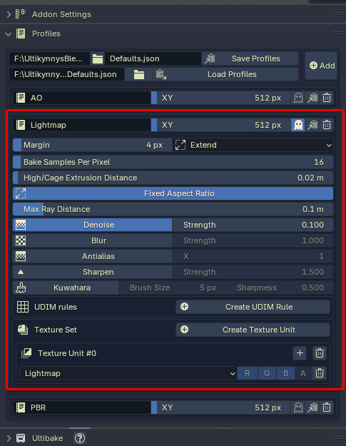

* **Margin** - Extra padding from the UV island borders, which prevents seams when dealing with LODs.

* **XY** - The dimensions of the image that will be baked. Can be toggled with the **Fixed Aspect Ratio** button to expose X and Y separately.

* **Cage Extrusion** - How much to inflate the **Cage** object, useful for tweaking **High** to **Low** baking.

* **Max Ray Distance** - How far a ray can be cast from a **High** object when projected to a **Low** object.

* **Bake Samples Per Pixel** - Controls how many passes each pixel in the baked texture will receive during the baking process. It's a good idea to **set this to a low value** due to its **impact on bake time**.

* **Quality** - Controls the compression ratio for JPEG and PNG textures.

## Post-Process Effects

> These are applied after the bake. The effects stack and are applied in top-to-bottom order.

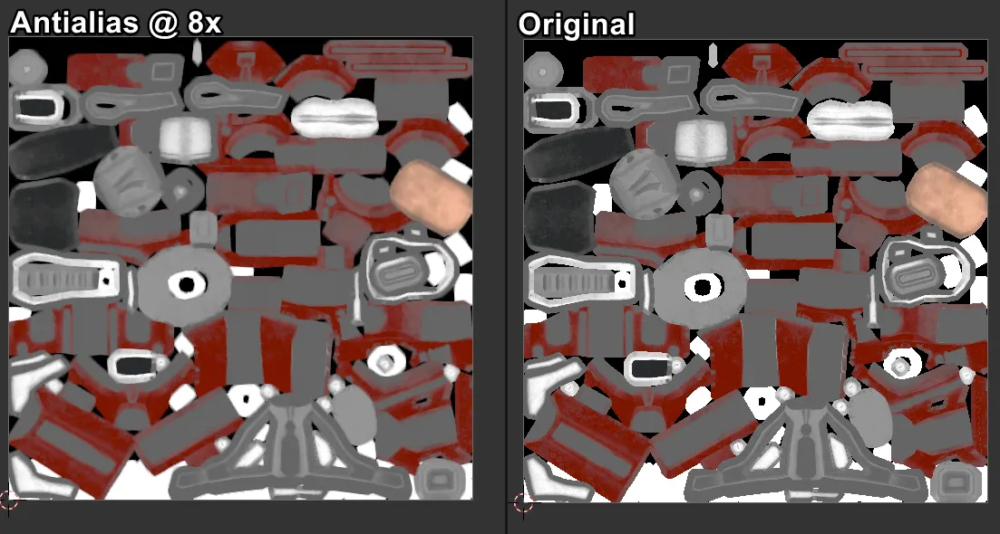

## UDIMs

* **Add UDIM Scale Rule Button** - Adds a resolution multiplier to any UV islands that are in the corresponding UDIM tile.

> **UDIMs are handled automatically by Ultibake**, so you only have to ensure that the UV islands are packed in the correct tiles. I highly recommend UVPackmaster3 for this.

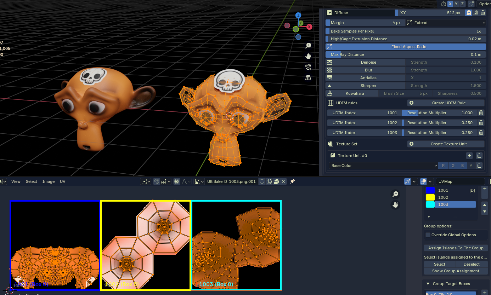

## Bake Units

> With **Bake Units**, we can define the **objects that are used for baking**. It also contains the target UV map, which is required for the bake. A **Bake Set** can contain any number of **Bake Units**, allowing you to easily bake multiple objects for each profile.

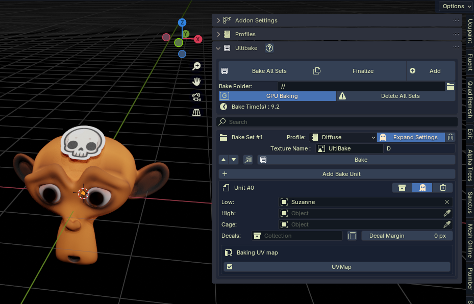

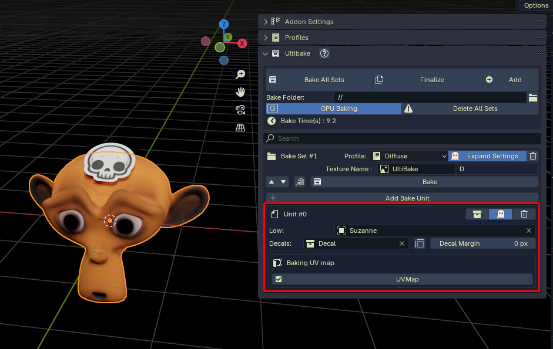

* **Low** - The object/collection that will be baked.
> Uses the UV map selector shown in the image below.

* **High** - The object that will be projected onto the surface of the **Low** object.
> Commonly used for baking high-detail meshes to low-poly representations.

* **Cage** - The object that will define how the projection from **High** to **Low** baking will behave.
> Optional, rarely needed, but useful for complicated high-to-low bakes.

* **Decals** - The collection whose meshes will be projected onto the **Low** object.
> Similar to High to Low baking but contains internal preprocessing to ensure better results.

* **Decals Only Toggle** - As its name implies, this will bake the **Decals** to the **Low** object but not the underlying **Low** object itself.
> Useful when your application requires you to apply decals on top of an existing texture.

* **Collection Toggle** - A toggle that will convert the **Low** parameter to a collection instead.
> This will prevent you from using High to Low baking or Decals, but it's crucial for bakes that contain many objects.

* **Baking UV Map** - A convenient selector for choosing which UV map to use for the **Low** object or **Low** collection.
> With collections, it will only show UV maps that are shared with all the other objects in the low collection.

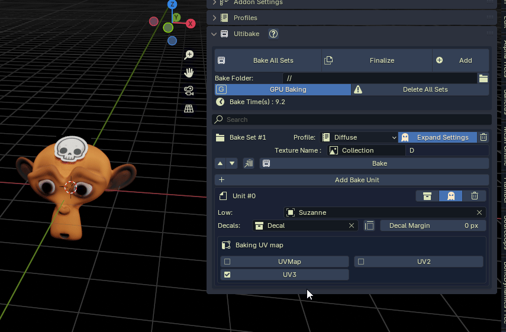

## Texture Units

> A profile contains a **Texture Set**, which contains **Texture Units**. These are used to define a single texture to be baked using **Bake Types**.

> To the right of the image name is a suffix that is dynamically generated. You can change the suffix letters in the settings or even remove them.

> The suffix can be disabled from the addon parameters by unticking **Auto Suffix**.

> Having **multiple Texture Units** results in the Bake Set **baking multiple textures** at once.

## Bake Types

> With **Bake Types**, we can define what is baked from the materials that are applied to the objects in the **Bake Units**. The **materials must utilize the Principled BSDF node**, and any material that is not using this node will have to be manually converted to utilize it. **The Bake Types reflect the inputs of the Principled BSDF node** except for a few special types that are unique to the addon.

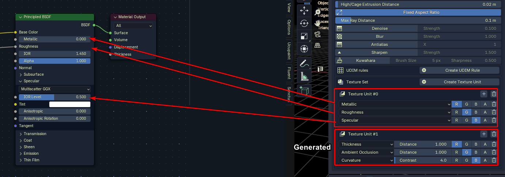

> Each **Bake Type** has a channel selector. Note that you can select multiple channels for a Bake Type with Shift + left-click.

## Special Bake Types

> **Bake Types** that are not specified on the Principled BSDF node are called **Special Bake Types**. These generate nodes automatically during the bake, which result in the desired bake.

### Normalized Position

> This is equivalent to the **Position Bake** from Substance Painter using bbox as the normalization type.

> Since the axis changes depending on the platform, we have to configure the correct one depending on the platform.

> The resulting baked texture looks like the following. Each axis contains a 0 to 1 gradient using the mesh bounding box.

### Smoothness

> Basically the inverse of roughness.

### Curvature

> The **pointiness** of the mesh curvature. **Mesh density** has a great effect on this bake type.

### Glossy Map

> The **surface reflection** of the mesh. **Roughness** has a great effect on this bake type.

#### Light Map

> The surface **brightness** and **color** from light sources.

### ColorID

> Using the user-defined colors from the bake unit, we can color each bake unit to have a unique color.

### Ambient Occlusion

> Distance calculation to the closest mesh.

> In rare cases the baking will fail, this can be caused by invalid object data.
Broken object data causing mesh to bake a fully white AO bake.

> Select your broken Object and click the **Object Data Fix** button

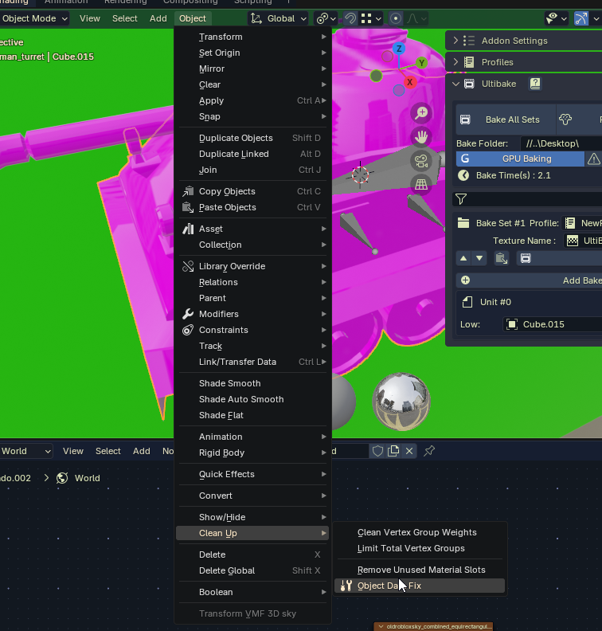

> Fixed Result

### Thickness
> Taken from Substance Painter, it's basically AO, but the rays are cast inside the mesh instead of outside.

### Normal Map

> Baking normal maps is a very useful technique. Either by defining a **high object** or by using a **multi-resolution modifier**, we can bake high-detail surface imperfections to a texture.

### World Space Normal

> Same as a normal map, but it's in world space.

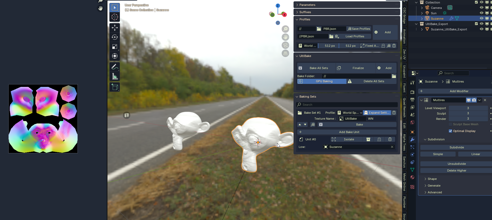

## Finalize

> **The last part in the pipeline** once the bake is complete. With a single click, you can create copies of your **Bake Set** objects that now utilize only the baked textures. This is great for ensuring consistency and also makes your objects ready for exporting.

## Decals

> All Bake Units contain a single collection slot reserved for any decals.

> The objects in this collection should be Curve Objects, Font Objects, or Mesh Objects.

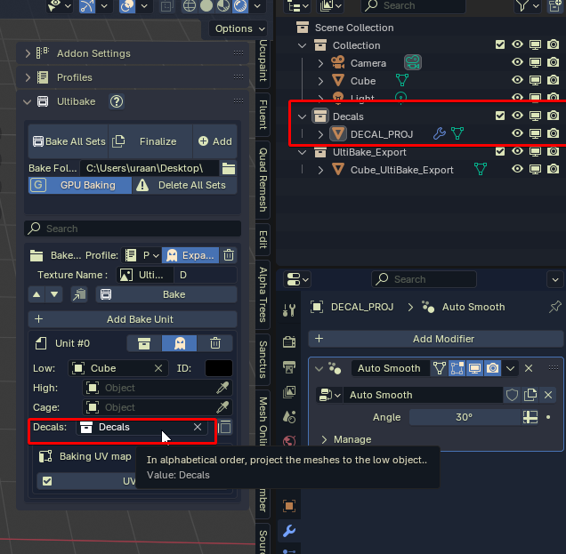

> Decals can be baked in two projection modes specified by the > _PROJ suffix on the decal object. If the projected decal doesn't work, try this.

> The > _PROJ suffix should not be used with text objects.

## Parameters

> There are various controls in the addon parameters that need explaining.

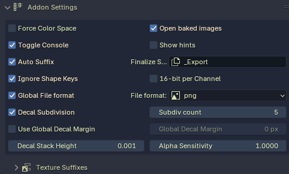

* **Force Color Space** - A toggle that gives you the option to set the color space of a baked texture. Manually setting this is rarely required since it's automatically determined from the **Bake Types**. In certain situations, you may need to control this explicitly.

* **Toggle Console** - Whenever you bake something on Windows, a console will open up which has a visual progress bar and the option to cancel the bake with E+Ctrl.
> Yes, it's reversed (does not currently work on non-Windows machines).

* **Auto Suffix** - Generates the suffix for the texture name from the bake types.

> You can also manually define the suffixes from the first panel.

* **Ignore Shape Keys** - When baking objects that utilize shape keys, you might not want to bake the distorted mesh if it is affected by things like AO or Decals.

* **Global File Format** - Specify the texture format on a **Bake Set** basis or use the same file format for all **Bake Sets**.

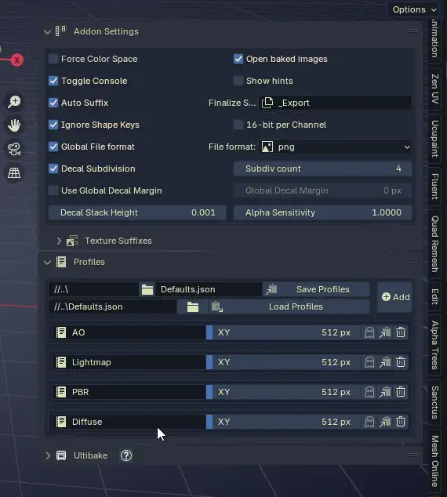

* **Decal Subdivision** - Decals are shrink-wrapped around the **Low** object. This ensures that the shrink-wrapping works correctly. Some meshes require more subdivisions, which can be increased using the value to the right of this tickbox.

* **Use Global Decal Margin** - Just like with the margin for baking, you can specify how much margin the **Decals** have when they are baked to the UV islands on the Low object.

* **Decal Stack Height** - This is the height at which the **Decals** are shrink-wrapped to the surface of the Low object. Depending on the mesh resolution of the decal, this should be adjusted accordingly.

* **Alpha Sensitivity** - Multiplies all alpha channels by this value. Ideal for crisper edges when using decals. You can also manually adjust this in the material, but this is more convenient.

## Stamp it!

> Any non-mesh-based decal method, like with the "Stamp It!" Addon, does not require the decal collection since it's applied directly to the material. Simply just bake the object with the material.

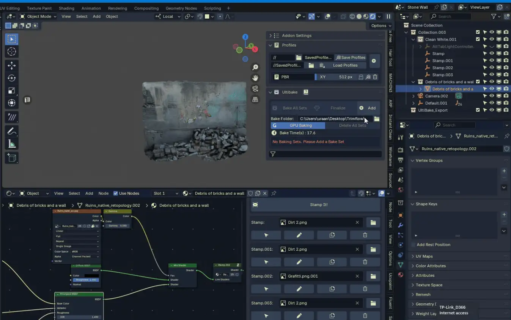

### Support

> If you find yourself stuck or if something isn't working as you intended, ask about it in the [Discord channel](https://discord.gg/RvT8jKRevG).